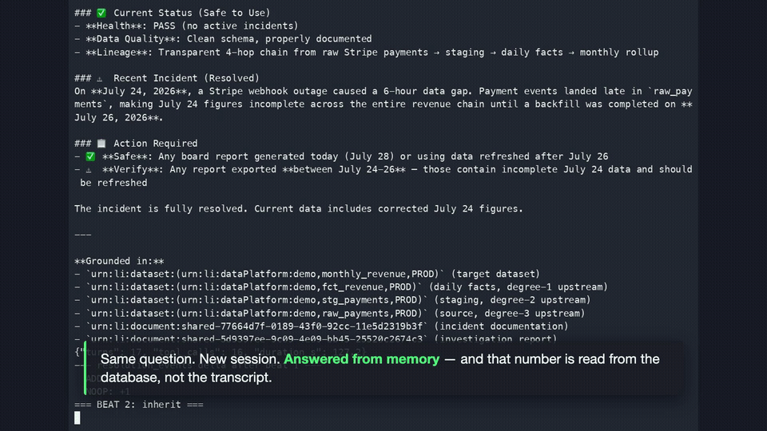
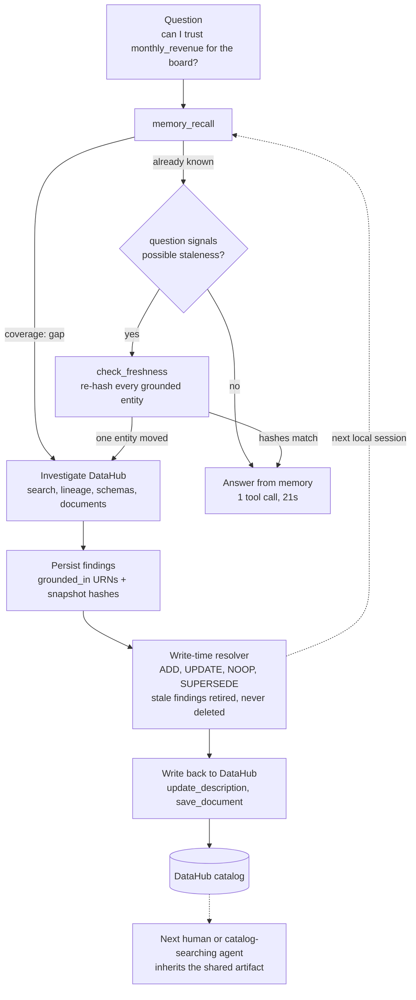

# datahub-memory 🧠

**Makes DataHub your team's institutional knowledge base: investigate once, preserve the conclusion, and put the shared result where the team already looks.**

[](https://datahub.devpost.com/)
[](https://github.com/datahub-project/datahub-skills/pull/62)
[](https://github.com/datahub-project/datahub-skills/pull/69)
[](LICENSE)
-brightgreen.svg?style=flat-square)


[](https://youtu.be/d-R0-WuPzXw)

## The 30-second case

Data teams repeatedly answer the same trust questions by walking lineage, schemas, and incident
context. The answer then disappears into a chat or one person's memory.

**datahub-memory closes DataHub's official
[read → act → write-back](https://datahub.com/blog/build-with-datahub-agent-hackathon/#the-four-challenge-categories)
loop.** It recalls prior conclusions first, investigates the catalog only when needed, grounds each
finding in DataHub URNs plus a structural snapshot hash, and publishes the result back through
DataHub's native `update_description` and `save_document` mutations.

### Measured before vs. after

One question, captured live against DataHub OSS quickstart:

| Run | Total agent tool calls | Duration | Result |
|---|---:|---:|---|
| **Cold — first investigation** | 16 | 127.2s | Walks the catalog, persists findings, and writes the result back. |
| **Warm — same local store, fresh Claude context** | **1** | **20.9s** | One `memory_recall`; no DataHub calls. |

**Outcome: 16× fewer tool calls and ~6× faster.** These are measured execution counts, not a
claim of equivalent LLM-cost reduction. Source: [`demo/counters-baseline.json`](demo/counters-baseline.json).

**▶ [Watch the 2:31 demo](https://youtu.be/d-R0-WuPzXw)** — write-back lands at
[0:50](https://youtu.be/d-R0-WuPzXw?t=50), one-call recall appears at
[0:58](https://youtu.be/d-R0-WuPzXw?t=58), and explicit re-verification detects catalog drift and
corrects stale documentation at [2:00](https://youtu.be/d-R0-WuPzXw?t=120).

## Fast audit — no setup required

1. **See the behavior:** use the three timestamps above.
2. **Read what landed in DataHub:** [`examples/datahub-writebacks.md`](examples/datahub-writebacks.md).
3. **Inspect grounded answers and hashes:** [`examples/investigation-answer.md`](examples/investigation-answer.md).
4. **Inspect resolver history and the retirement gate:**
   [`examples/resolution-log.md`](examples/resolution-log.md) and
   [`examples/verify-only-output.md`](examples/verify-only-output.md).

For a live reproduction, jump to the [judge quickstart](#quickstart-for-judges).

## Challenge 1 and rubric alignment

Entered in **Build with DataHub: The Agent Hackathon — Challenge 1,
“Agents That Do Real Work.”** The official challenge asks agents to read DataHub, act, and write
results back so another person or agent can inherit the context. The
[judging rubric](https://datahub.devpost.com/) maps directly to the implementation:

| Criterion | Evidence in this project |
|---|---|
| **Use of DataHub** | Reads search, lineage, schemas, and Documents through `mcp-server-datahub`; writes a description and attached report back to the context graph. |
| **Technical execution** | Reproducible three-beat runner, structural snapshot hashing, write-time reconciliation, and a gate that checks version retirement in SQLite. |
| **Originality** | Adds a persistent, recall-first conclusion layer on top of DataHub rather than rebuilding catalog features. |
| **Real-world usefulness** | Avoids re-running the same catalog investigation while keeping the team-visible result on the entity itself. |
| **Submission quality** | 2:31 demo, verbatim sample outputs, two evaluation paths, and automated local setup. |
| **Open-source bonus** | Two **open** DataHub Skills PRs: [`datahub-investigate` #62](https://github.com/datahub-project/datahub-skills/pull/62) and [`datahub-memory` #69](https://github.com/datahub-project/datahub-skills/pull/69). |

## The sharing boundary

The **fast warm-recall result is local**: delapan stores private findings in SQLite, one store per
machine. The **team-shared result is DataHub**: descriptions and Documents are published into the
catalog, where humans and catalog-searching agents can discover them.

SQLite is a deliberate evaluation default, not an enterprise-storage claim. It removes the need for
an external persistence service, DataHub Cloud, or a live warehouse while preserving a full local
DataHub write-back demonstration. The demo still requires model-provider credentials. A centralized
Postgres/pgvector finding tier is future work.

Three Claude Code skills consume the memory layer:

| Skill | What it is |
|---|---|
| `/datahub-memory:investigate` | Recall first; search lineage, schemas, and Documents only where memory is thin; then persist and write back. |
| `/datahub-memory:recall` | Memory-only lookup; runs the structural freshness check when the question explicitly requests re-verification. |
| `/datahub-memory:writeback` | Record a conclusion on a DataHub entity, using native mutation tools first. |

## Pre-existing code disclosure

This project depends on [delapan](https://github.com/anthonysuherli/delapan) (AGPL-3.0), a
pre-existing open-source engine written and owned by the entrant. All code in this repository is new
work created during the submission period and is licensed Apache-2.0.

## What it is

A place for an agent's *conclusions* to live — locally for low-latency recall and in DataHub for
team-visible sharing. The catalog already models the connective tissue (lineage, schema, and
Documents) that makes an investigation possible; datahub-memory adds a memory-specific interface for
what an agent concludes after walking that tissue:

| Tool | Does |
|---|---|
| `memory_recall` | Tap prior grounded knowledge for a question; returns a preamble plus a coverage band (`rich` / `sparse` / `gap`) and a route. |
| `memory_persist` | Store a conclusion as a delapan finding `grounded_in` DataHub URNs + a structural snapshot hash. When enabled, the LLM-backed write-time resolver attempts ADD / UPDATE / NOOP / SUPERSEDE reconciliation against related findings. |
| `check_freshness` | On explicit re-verification, compare each recorded hash with the entity's current field paths/types and upstream URNs. A mismatch identifies which structural snapshot changed. |
| `writeback_description` / `writeback_report` | Push what was learned back into the catalog, so the next reader inherits it from DataHub rather than from this tool's private store. |

An agent that calls these gets memory-first answers, on-demand structural staleness detection, and —
the part the team actually sees — catalog write-backs that survive beyond the private local store. The
investigate skill is one such agent; so is the scripted CLI; so, in principle, is yours.

### The loop the investigate skill runs

The memory layer is the boxes in bold type below — `memory_recall`, `check_freshness`, persist, write back. The investigate skill is the thing that sequences them and fills the gap from DataHub when memory is thin.



The two dashed paths are intentionally different: a new local session recalls the private SQLite
finding directly, while another person or machine inherits the published DataHub artifact through
the catalog.

## Measured results (canonical run, `demo/counters-baseline.json`)

Three beats, one question ("Can I trust `monthly_revenue` for the board report?"), run live against a docker-quickstart DataHub v1.5.0.6 + `mcp-server-datahub` v0.6.0 on 2026-07-28.

| Beat | Turns | Tool calls | Duration | What it proves |
|---|---|---|---|---|
| 1 — investigate (fresh memory) | 17 | 16 | 127.2s | Full investigation: search → lineage → institutional memory → 4 `memory_persist` calls (resolver: 3× `ADD` + 1× `NOOP`) → write-back (`update_description` on `stg_payments`, `save_document` for the report). |
| 2 — inherit (same question, fresh session) | 2 | 1 | 20.9s | Instant answer from memory: one `memory_recall` call, zero DataHub tool calls, cites beat 1's finding ids and URNs directly. ~8x fewer turns, 16x fewer tool calls, ~6x faster than beat 1. |
| 3 — catalog drift → explicit re-verify | 11 | 10 | 98.4s | `demo/drift.py` changes the cataloged `stg_payments` schema from `amount_usd` to `amount`. Re-asking with a re-verification signal runs `check_freshness`, identifies the changed structural snapshot, and forces a targeted investigation. Canonical resolver delta: 2× `ADD` + 1× `UPDATE`; the update retires finding `75a5ab8b` in favor of `aabef4d1`. |

The retirement is a versioned soft retirement: the stale row's `invalidated_at` is set, nothing is
deleted, and `resolution_events` records why. The resolver classified this run as `UPDATE` rather
than `SUPERSEDE`; both use the same supersession code path. See [`examples/`](examples/README.md) for
the finding content and resolution history, and
[`examples/datahub-writebacks.md`](examples/datahub-writebacks.md) for the report and description
read back from DataHub after beats 1 and 3.

## Quickstart for judges

Prerequisites: Docker running, Python 3.11+, git, sqlite3, and [uv](https://docs.astral.sh/uv/) (required — both forms spawn `uvx mcp-server-datahub`).

### Shared setup

```bash
# 1. Install (creates .venv, pulls delapan[local] + claude-agent-sdk + acryl-datahub)
python3 -m venv .venv
source .venv/bin/activate
pip install -e ".[dev]"

# 2. Bring up DataHub + mint a personal access token -> writes .env.local
demo/quickstart.sh
source .env.local

# 3. Seed the demo catalog (4-dataset revenue chain + lineage + one incident,
#    published as a DataHub Document so the agent's own MCP tools can find it)
python -m demo.seed
```

The memory layer needs one credential beyond what `quickstart.sh` writes into `.env.local`
(`DATAHUB_GMS_URL`, `DATAHUB_GMS_TOKEN`, `DLP_MEMORY__ENABLED=true`, `DELAPAN_DB_PATH`):
**`AI_GATEWAY_API_KEY`**. It powers delapan's resolver and can also power embeddings.
`OPENAI_API_KEY` is an alternative embeddings key, not a replacement for the resolver credential
used in the demonstrated ADD / NOOP / UPDATE flow. Path B also needs agent authentication, described
below. See `.env.example` and `docs/R1-decision.md`.

No DataHub Cloud license, warehouse, external data source, or external persistence service is
required. DataHub and SQLite run locally; model calls still use the configured provider.

### Path A — Claude Code (the primary interface)

Claude Code **is** the agent here. The plugin registers both MCP servers and the three skills, and
your logged-in Claude Code session drives the loop, so this path does not separately require
`ANTHROPIC_API_KEY`.

```bash
claude plugin marketplace add .
claude plugin install datahub-memory@datahub-memory
claude          # launch from the same shell where you sourced .env.local
```

Then reproduce the three beats from the [demo video](https://youtu.be/d-R0-WuPzXw) by typing these prompts:

**Beat 1 — cold start.** Memory is empty, so it has to walk the catalog.

```
/datahub-memory:investigate Can I trust monthly_revenue for the board report?
```

*Expect:* `memory_recall` returns coverage `gap` → 16 total agent tool calls in the canonical run,
including DataHub reads, memory persistence, and write-back → 3-4 findings persisted → a description
and report written back. Roughly two minutes. Watch `stg_payments` in the DataHub UI at
http://localhost:9002.

**Beat 2 — inherit.** Same question, clean context. Run `/clear` first, or start a second `claude`.

```
/datahub-memory:recall Can I trust monthly_revenue for the board report?
```

*Expect:* one `memory_recall` call, **zero** DataHub calls, and an answer citing beat 1's finding ids and URNs. Seconds, not minutes — this is the 16 → 1 comparison.

**Beat 3 — drift.** In another shell, rename a column out from under the memory:

```bash
python -m demo.drift      # stg_payments.amount_usd -> amount
```

```
/datahub-memory:investigate Can I trust monthly_revenue for the board report? (re-verify: upstream schema may have changed)
```

*Expect:* the explicit staleness wording routes to `check_freshness`, which compares all four
recorded structural snapshots and names `stg_payments` as changed. The stale trust verdict is retired
with history retained, and the stale DataHub description is corrected. A normal repeat question does
not run this check; freshness verification is on demand.

Confirm the retirement straight from the store:

```bash
sqlite3 .data/delapan.db \
  "SELECT CASE WHEN invalidated_at IS NULL THEN 'live' ELSE 'retired' END, COUNT(*) FROM findings GROUP BY 1;"
sqlite3 .data/delapan.db "SELECT op, COUNT(*) FROM resolution_events GROUP BY op;"
```

### Path B — scripted CLI (non-interactive)

The same three beats without a human in the loop, with a hard gate on beat 3:

```bash
# Full 3-beat scenario (~5 min). Exits non-zero and prints the failing delta if
# beat 3 doesn't actually retire the stale finding while retaining its history.
demo/run_demo.sh

# Re-check that gate against the DB a previous full run left behind:
demo/run_demo.sh --verify-only
```

This path drives the turns itself via the Claude Agent SDK, so unlike Path A it **also** needs a logged-in `claude` CLI on the host or `ANTHROPIC_API_KEY` set. `--verify-only` reads snapshots written by a full run, so run the full scenario at least once first.

**Run the full script only against the disposable quickstart catalog.** Its clean-baseline step
clears prior editable descriptions and hard-deletes non-seed Documents found in the configured
DataHub instance.

## Architecture

```
  user question
       │
       ▼
  CONSUMERS — any agent can be one; three ship here
       │  /datahub-memory:investigate   the flagship loop (what the video shows)
       │  /datahub-memory:recall        memory-only lookup + freshness check
       │  /datahub-memory:writeback     record onto the entity
       │  python -m datahub_memory      the same investigate loop, non-interactive
       │
       ▼
  THE MEMORY LAYER — five memory-specific tools
       │
       ├──► memory MCP (custom wrapper around delapan: memory_recall, memory_persist,
       │      check_freshness, writeback_description, writeback_report)
       │      ──► delapan[local] (SQLite tier)
       │            select_preamble (coverage: rich/sparse/gap)      ← recall path
       │            resolve_and_persist (ADD/UPDATE/NOOP/SUPERSEDE)  ← memory writes
       │
       └──► DataHub MCP  ──► mcp-server-datahub (stdio) ──► DataHub OSS quickstart (docker)
              search / get_entities / get_lineage / get_dataset_queries / …  ← reads
              update_description / save_document / add_terms / add_tags / …  ← write-back
              (TOOLS_IS_MUTATION_ENABLED=true; OSS-available on DataHub >=1.4.0,
               no Cloud license required — see docs/R1-decision.md)
```

- **Two MCP servers, one agent.** `mcp-server-datahub` (v0.6.0 in the canonical run; empirically 8 read /
  12 write tools once mutations are on and the Document catalog is non-empty — see
  `docs/R1-decision.md`'s tool inventory) and delapan's tools run side by side as two
  MCP servers under one Claude Agent SDK loop; the agent loop is the only new
  orchestration code.
- **Memory bridge** (`datahub_memory/bridge.py`): delapan project = DataHub instance;
  KB per domain. Every finding's `grounded_in` carries the DataHub URNs it was derived
  from plus a `snapshot_hash` (schema fields + lineage, hashed at capture time).
- **Memory-first routing** (`datahub_memory/agent.py:route`): every question first
  calls `memory_recall`. `gap` coverage → full investigation. `rich` or `sparse` →
  `answer_from_memory` — answer from what's known, and only pay for a DataHub round
  trip if the question itself explicitly signals possible staleness.
- **On-demand structural drift detection** (`check_freshness`): when a staleness-signaling
  question hits `answer_from_memory`, the agent calls `check_freshness` exactly once
  over every grounded URN. It recomputes each entity's `snapshot_hash` from DataHub's
  current field paths/types and upstream URNs and diffs it against the hash stored on
  the finding. A mismatch identifies a changed recorded snapshot and forces a targeted
  re-investigation and a new `memory_persist`, which the resolver attempts to reconcile
  against the stale finding (versioned soft retirement — see above). Grounded
  URNs are read from each finding's full stored row, not delapan's 1200-char-truncated
  preamble copy, so a finding with a long conclusion and several grounded entries can't
  silently lose entries `check_freshness` should have re-hashed.
- **Write-back loop**: DataHub's own MCP mutation tools are primary —
  `update_description` fills empty/stale descriptions, `save_document` attaches the
  investigation report. The emitter/GraphQL path in `datahub_memory/writeback.py` is
  kept only as a fallback for environments that can't run the MCP mutation tools, not
  because MCP mutations are Cloud-gated (they aren't, on OSS ≥1.4.0).

## Claude Code plugin

Claude Code is the primary interface — see [Path A](#path-a--claude-code-the-primary-interface) above for the install and the three prompts. This section is what that install actually wires up.

The plugin (`.claude-plugin/`, `mcp.json`, `skills/`) registers two stdio MCP servers (`memory` — a `FastMCP` wrapper around the same `bridge`/`writeback` code the CLI uses, via `scripts/mcp-server.sh`; `datahub` — `uvx mcp-server-datahub`) and three skills:

- `/datahub-memory:investigate` — the full memory-first loop (recall → walk lineage, schemas, and discoverable Documents when memory is thin → persist 2-4 grounded findings → hand off to write-back).
- `/datahub-memory:recall` — memory-only lookup with the bounded freshness check; escalates to `/investigate` on `gap` coverage or confirmed drift.
- `/datahub-memory:writeback` — attach a description or report to a DataHub entity; DataHub's own mutation tools first, the emitter fallback tools only if those fail.

Requires `uv` on the host and `DATAHUB_GMS_URL`, `DATAHUB_GMS_TOKEN`, and
`AI_GATEWAY_API_KEY` exported in the shell that launches `claude`; `OPENAI_API_KEY` may be supplied
as the embeddings provider. `mcp.json` passes them through to the servers. Claude Code supplies the
agent turns, so this path does not need separate Agent SDK authentication.

## Upstream contribution

Open PR [`datahub-project/datahub-skills#62`](https://github.com/datahub-project/datahub-skills/pull/62)
— `datahub-investigate`, generalizing this submission's investigate → trace → persist → write-back
pattern for agents working against DataHub.

Open PR [`datahub-project/datahub-skills#69`](https://github.com/datahub-project/datahub-skills/pull/69)
— `datahub-memory`, a vendor-neutral recall-first workflow with DataHub Documents as the
catalog-native memory store. It is independent of #62 and designed to compose with it.

## Design notes

- **Pure-emitter seed instead of a live warehouse.** The demo catalog (`demo/seed.py`) publishes schema, lineage, and one incident directly via DataHub's Python emitter rather than standing up a real warehouse (e.g. DuckDB) behind an ingestion source. Fewer moving parts for judges to reproduce, and the lineage/schema realism the demo depends on — snapshot hashes over real `SchemaMetadataClass`/`UpstreamLineageClass` aspects — is identical either way; a live warehouse would add setup risk without changing what the drift-detection demo actually proves.
- **The incident is seeded as a DataHub Document, not just institutional memory.** `mcp-server-datahub` v0.6.0 exposes mutation tools to *write* `InstitutionalMemoryClass` but no read tool to fetch it back — discovered live while building the demo (see `demo/seed.py`'s module docstring). An agent driven only by that MCP server could never see an incident recorded that way. The incident is published twice: once as `InstitutionalMemoryClass` (kept for UI parity and any future read tool), and once as a `save_document`-created Document, which *is* discoverable via `search_documents`/`grep_documents` — the one the agent actually finds.
- **Versioned retirement, op-label agnostic.** A stale finding is not deleted:
  `invalidated_at` is set, `superseded_by` points forward, and `resolution_events` records the
  decision. delapan labels a retirement `UPDATE` or `SUPERSEDE` based on its classification of the
  relationship; both route through the same supersession code path.

## License

This repository (`datahub-memory`) is licensed **Apache-2.0** (see `LICENSE`) — all code here is new
work written during the submission period. Its dependency,
[delapan](https://github.com/anthonysuherli/delapan), is **AGPL-3.0** and is disclosed above: it is a
pre-existing engine written and owned by the entrant, consumed as a pinned package dependency rather
than copied into this repository.
