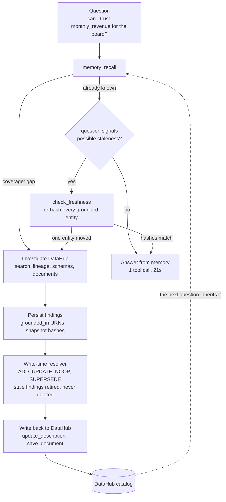

# datahub-memory

Grounded institutional memory for data teams: DataHub agent with delapan write-time-resolved memory.

[](LICENSE)
-brightgreen.svg)


[](https://youtu.be/d-R0-WuPzXw)

**▶ [Watch the 2:31 demo](https://youtu.be/d-R0-WuPzXw)** — split-screen, the real Claude Code TUI on the left and the live DataHub page on the right, both recorded in the same wall-clock window: the write-back landing in the catalog at 0:50, the same question answered from memory at 0:58, and a schema drift caught and corrected at 2:00.

datahub-memory is a DataHub investigation agent with grounded, self-correcting memory. It reads DataHub entirely through `mcp-server-datahub`'s own tools — search, lineage, schema, and document reads — and writes what it learns back through DataHub's own mutation tools (`update_description`, `save_document`), so the catalog itself inherits the answer, not just the agent's private memory. Every conclusion is persisted as a delapan finding `grounded_in` the exact DataHub URNs it was derived from, and deterministically re-verified — by re-hashing those entities' current schema and lineage, never by guessing — the moment the world underneath it changes.

Measured live against a docker-quickstart DataHub v1.5.0.6 + `mcp-server-datahub` v0.6.0 (`demo/counters-baseline.json`): investigating a trust question the first time costs 16 tool calls and 127s; asking the identical question again in a fresh session answers from memory in 1 tool call and 21s. The same pattern is contributed upstream as two DataHub multi-agent skills: [datahub-project/datahub-skills#62](https://github.com/datahub-project/datahub-skills/pull/62) (`datahub-investigate` — the deep-dive) and [#69](https://github.com/datahub-project/datahub-skills/pull/69) (`datahub-memory` — recall-first with documents as the catalog-native memory store).

## Pre-existing code disclosure

This project depends on [delapan](https://github.com/anthonysuherli/delapan) (AGPL-3.0), an open-source engine written and owned by the entrant. All code in this repository is new work created during the submission period and is licensed Apache-2.0. Because the entrant is delapan's sole copyright holder, its use here is at the entrant's own grant; no third-party license obligations are created by this combination.

## What it is

An agent that investigates a data question by walking DataHub — search, lineage, schemas, institutional memory — and persists every conclusion as a delapan finding `grounded_in` the DataHub URNs it derived it from. The next time anyone (or any agent) asks a related question, it answers instantly from memory instead of re-investigating, and — deterministically, by re-hashing each grounded entity's current schema and lineage rather than guessing — knows the moment that memory has gone stale. What it learns is written back to DataHub itself (`update_description`, `save_document`), so the catalog, not just the agent's private memory, inherits the answer.

### The loop



The dashed edge is the whole point: the answer lands back in the catalog, so the next person — or the next agent — starts from it instead of re-deriving it.

## Measured results (canonical run, `demo/counters-baseline.json`)

Three beats, one question ("Can I trust `monthly_revenue` for the board report?"), run live against a docker-quickstart DataHub v1.5.0.6 + `mcp-server-datahub` v0.6.0 on 2026-07-28.

| Beat | Turns | Tool calls | Duration | What it proves |
|---|---|---|---|---|
| 1 — investigate (fresh memory) | 17 | 16 | 127.2s | Full investigation: search → lineage → institutional memory → 4 `memory_persist` calls (resolver: 3× `ADD` + 1× `NOOP`) → write-back (`update_description` on `stg_payments`, `save_document` for the report). |
| 2 — inherit (same question, fresh session) | 2 | 1 | 20.9s | Instant answer from memory: one `memory_recall` call, zero DataHub tool calls, cites beat 1's finding ids and URNs directly. ~8x fewer turns, 16x fewer tool calls, ~6x faster than beat 1. |
| 3 — drift → re-verify | 11 | 10 | 98.4s | `demo/drift.py` renames `stg_payments.amount_usd` → `amount`. Re-asking the same question (worded to signal possible staleness) routes to memory first, but the deterministic `check_freshness` tool re-hashes the grounded entities against DataHub's *current* state, flags `stg_payments` as changed, and forces a targeted re-investigation. Resolver: `ADD` (new schema-drift finding) + `UPDATE` (retires the stale beat-1 trust-verdict finding, `75a5ab8b` → `aabef4d1`). |

The retirement in beat 3 is bi-temporal — the stale finding's `invalidated_at` is set, nothing is deleted, and `resolution_events` keeps a permanent record of why. The resolver classified this particular retirement as `UPDATE` rather than `SUPERSEDE`; both route through the same `store.supersede_finding` code path, so the op label is the resolver's refine-vs-contradict judgment call, not a different mechanism — the bi-temporal retirement is the point being demonstrated, not the label. See [`examples/`](examples/README.md) for the real finding content and resolution-event rows behind this table, and [`examples/datahub-writebacks.md`](examples/datahub-writebacks.md) for the artifacts the agent wrote back **into DataHub** — an authored trust-review Document and the `stg_payments` description, each shown as beat 1 wrote it and as beat 3 corrected it, read verbatim out of the live catalog.

## Quickstart for judges

Prerequisites: Docker running, Python 3.11+, git, sqlite3, and [uv](https://docs.astral.sh/uv/) (required — both forms spawn `uvx mcp-server-datahub`).

### Shared setup

```bash
# 1. Install (creates .venv, pulls delapan[local] + claude-agent-sdk + acryl-datahub)
python3 -m venv .venv
source .venv/bin/activate
pip install -e ".[dev]"

# 2. Bring up DataHub + mint a personal access token -> writes .env.local
demo/quickstart.sh
source .env.local

# 3. Seed the demo catalog (4-dataset revenue chain + lineage + one incident,
#    published as a DataHub Document so the agent's own MCP tools can find it)
python -m demo.seed
```

One credential is required beyond what `quickstart.sh` writes into `.env.local` (`DATAHUB_GMS_URL`, `DATAHUB_GMS_TOKEN`, `DLP_MEMORY__ENABLED=true`, `DELAPAN_DB_PATH`): **`AI_GATEWAY_API_KEY` (or `OPENAI_API_KEY`)**, for delapan's own embedding/LLM calls behind `memory_recall`/`memory_persist`. See `.env.example` and `docs/R1-decision.md`.

No DataHub Cloud license, no warehouse, no external data source — the whole demo runs against a local OSS `docker quickstart` and a small seeded catalog.

### Path A — Claude Code (the primary interface)

Claude Code **is** the agent here. The plugin registers both MCP servers and the three skills, and your Claude Code session drives the loop — so there is nothing further to authenticate: no `ANTHROPIC_API_KEY`, no Agent SDK runner.

```bash
claude plugin marketplace add .
claude plugin install datahub-memory@datahub-memory
claude          # launch from the same shell where you sourced .env.local
```

Then reproduce the three beats from the [demo video](https://youtu.be/d-R0-WuPzXw) by typing these prompts:

**Beat 1 — cold start.** Memory is empty, so it has to walk the catalog.

```
/datahub-memory:investigate Can I trust monthly_revenue for the board report?
```

*Expect:* `memory_recall` returns coverage `gap` → ~16 DataHub tool calls (search → lineage → schemas → documents) → 3-4 findings persisted → a description and a report document written back to `stg_payments`. Roughly two minutes. Watch `stg_payments` in the DataHub UI at http://localhost:9002 to see the write-back land.

**Beat 2 — inherit.** Same question, clean context. Run `/clear` first, or start a second `claude`.

```
/datahub-memory:recall Can I trust monthly_revenue for the board report?
```

*Expect:* one `memory_recall` call, **zero** DataHub calls, and an answer citing beat 1's finding ids and URNs. Seconds, not minutes — this is the 16 → 1 comparison.

**Beat 3 — drift.** In another shell, rename a column out from under the memory:

```bash
python -m demo.drift      # stg_payments.amount_usd -> amount
```

```
/datahub-memory:investigate Can I trust monthly_revenue for the board report? (re-verify: upstream schema may have changed)
```

*Expect:* the staleness wording routes to `check_freshness`, which re-hashes all four grounded entities and names `stg_payments` — not the lineage root — as the one that moved. The stale trust verdict is retired bi-temporally and the now-wrong description is corrected in DataHub.

Confirm the retirement straight from the store:

```bash
sqlite3 .data/delapan.db \
  "SELECT CASE WHEN invalidated_at IS NULL THEN 'live' ELSE 'retired' END, COUNT(*) FROM findings GROUP BY 1;"
sqlite3 .data/delapan.db "SELECT op, COUNT(*) FROM resolution_events GROUP BY op;"
```

### Path B — scripted CLI (non-interactive)

The same three beats without a human in the loop, with a hard gate on beat 3:

```bash
# Full 3-beat scenario (~5 min). Exits non-zero and prints the failing delta if
# beat 3 doesn't actually produce a bi-temporal retirement.
demo/run_demo.sh

# Re-check that gate against the DB a previous full run left behind:
demo/run_demo.sh --verify-only
```

This path drives the turns itself via the Claude Agent SDK, so unlike Path A it **also** needs a logged-in `claude` CLI on the host or `ANTHROPIC_API_KEY` set. `--verify-only` reads snapshots written by a full run, so run the full scenario at least once first.

## Architecture

```
  user question
       │
       ▼
  Investigation agent  (Claude Agent SDK runner; also packaged as Claude Code plugin)
       │  skills: /investigate  /recall  /writeback
       │
       ├──► delapan MCP (in-process tools: memory_recall, memory_persist,
       │      check_freshness, writeback_description, writeback_report)
       │      ──► delapan[local] (SQLite tier)
       │            select_preamble (coverage: rich/sparse/gap)      ← recall path
       │            resolve_and_persist (ADD/UPDATE/NOOP/SUPERSEDE)  ← memory writes
       │
       └──► DataHub MCP  ──► mcp-server-datahub (stdio) ──► DataHub OSS quickstart (docker)
              search / get_entities / get_lineage / get_dataset_queries / …  ← reads
              update_description / save_document / add_terms / add_tags / …  ← write-back
              (TOOLS_IS_MUTATION_ENABLED=true; OSS-available on DataHub >=1.4.0,
               no Cloud license required — see docs/R1-decision.md)
```

- **Two MCP servers, one agent.** `mcp-server-datahub` (v0.6.0; empirically 8 read /
  12 write tools once mutations are on and the Document catalog is non-empty — see
  `docs/R1-decision.md`'s tool inventory) and delapan's tools run side by side as two
  MCP servers under one Claude Agent SDK loop; the agent loop is the only new
  orchestration code.
- **Memory bridge** (`datahub_memory/bridge.py`): delapan project = DataHub instance;
  KB per domain. Every finding's `grounded_in` carries the DataHub URNs it was derived
  from plus a `snapshot_hash` (schema fields + lineage, hashed at capture time).
- **Memory-first routing** (`datahub_memory/agent.py:route`): every question first
  calls `memory_recall`. `gap` coverage → full investigation. `rich` or `sparse` →
  `answer_from_memory` — answer from what's known, and only pay for a DataHub round
  trip if the question itself signals possible staleness.
- **Deterministic drift detection** (`check_freshness`): when a staleness-signaling
  question hits `answer_from_memory`, the agent calls `check_freshness` exactly once
  over every grounded URN. It recomputes each entity's `snapshot_hash` from DataHub's
  *current* schema fields and lineage and diffs it against the hash stored on the
  finding — no model judgment, no guessing which entity might have changed. A mismatch
  forces a targeted re-investigation and a new `memory_persist`, which the resolver
  reconciles against the stale finding (bi-temporal retirement — see above). Grounded
  URNs are read from each finding's full stored row, not delapan's 1200-char-truncated
  preamble copy, so a finding with a long conclusion and several grounded entries can't
  silently lose entries `check_freshness` should have re-hashed.
- **Write-back loop**: DataHub's own MCP mutation tools are primary —
  `update_description` fills empty/stale descriptions, `save_document` attaches the
  investigation report. The emitter/GraphQL path in `datahub_memory/writeback.py` is
  kept only as a fallback for environments that can't run the MCP mutation tools, not
  because MCP mutations are Cloud-gated (they aren't, on OSS ≥1.4.0).

## Claude Code plugin

Claude Code is the primary interface — see [Path A](#path-a--claude-code-the-primary-interface) above for the install and the three prompts. This section is what that install actually wires up.

The plugin (`.claude-plugin/`, `mcp.json`, `skills/`) registers two stdio MCP servers (`memory` — a `FastMCP` wrapper around the same `bridge`/`writeback` code the CLI uses, via `scripts/mcp-server.sh`; `datahub` — `uvx mcp-server-datahub`) and three skills:

- `/datahub-memory:investigate` — the full memory-first loop (recall → walk lineage/institutional memory when memory is thin → persist 2-4 grounded findings → hand off to write-back).
- `/datahub-memory:recall` — memory-only lookup with the bounded freshness check; escalates to `/investigate` on `gap` coverage or confirmed drift.
- `/datahub-memory:writeback` — attach a description or report to a DataHub entity; DataHub's own mutation tools first, the emitter fallback tools only if those fail.

Requires `uv` on the host (the launcher prints the install command and exits if it's missing) and `DATAHUB_GMS_URL`, `DATAHUB_GMS_TOKEN`, `AI_GATEWAY_API_KEY`/`OPENAI_API_KEY` exported in the shell you launch `claude` from — `mcp.json` passes them through to the servers. Note this is one credential fewer than the CLI: Claude Code supplies the model turns itself, so no Agent SDK auth is involved.

## Upstream contribution

[`datahub-project/datahub-skills#62`](https://github.com/datahub-project/datahub-skills/pull/62) — a `grounded-investigation` skill (frontmatter title: "feat: add datahub-investigate skill") contributed to DataHub's own multi-agent skills repo, generalizing this submission's investigate → trace → persist → write-back pattern for any agent working against DataHub (Claude Code, Cursor, Codex, Copilot, Gemini CLI, Windsurf).

[`datahub-project/datahub-skills#69`](https://github.com/datahub-project/datahub-skills/pull/69) — a `datahub-memory` skill: the recall-first workflow with DataHub documents as the catalog-native memory store (search prior reports → investigate only the gap → persist via `save_document` → supersede stale reports, never delete). Independent of #62; designed to compose with it.

## Design notes

- **Pure-emitter seed instead of a live warehouse.** The demo catalog (`demo/seed.py`) publishes schema, lineage, and one incident directly via DataHub's Python emitter rather than standing up a real warehouse (e.g. DuckDB) behind an ingestion source. Fewer moving parts for judges to reproduce, and the lineage/schema realism the demo depends on — snapshot hashes over real `SchemaMetadataClass`/`UpstreamLineageClass` aspects — is identical either way; a live warehouse would add setup risk without changing what the drift-detection demo actually proves.
- **The incident is seeded as a DataHub Document, not just institutional memory.** `mcp-server-datahub` v0.6.0 exposes mutation tools to *write* `InstitutionalMemoryClass` but no read tool to fetch it back — discovered live while building the demo (see `demo/seed.py`'s module docstring). An agent driven only by that MCP server could never see an incident recorded that way. The incident is published twice: once as `InstitutionalMemoryClass` (kept for UI parity and any future read tool), and once as a `save_document`-created Document, which *is* discoverable via `search_documents`/`grep_documents` — the one the agent actually finds.
- **Bi-temporal retirement, op-label agnostic.** A stale finding is never deleted — `invalidated_at` is set and `resolution_events` keeps a permanent record of the resolution. delapan's resolver labels a retirement `UPDATE` (refinement) or `SUPERSEDE` (outright contradiction) based on its own judgment of the relationship between old and new content; both route through the same `store.supersede_finding` code path. This submission treats either label as proof of the underlying mechanism — the retirement, not the word attached to it, is what "self-correcting memory" means here.

## License

This repository (`datahub-memory`) is licensed **Apache-2.0** (see `LICENSE`) — all code here is new work written during the submission period. Its dependency, [delapan](https://github.com/anthonysuherli/delapan), is **AGPL-3.0** and is disclosed above: it is a pre-existing engine written and owned by the entrant, consumed here as a `pip install "delapan[local]" @ git+...` dependency, not code copied into this repo. As the entrant holds sole copyright over delapan, no third-party license obligations arise from this combination.
